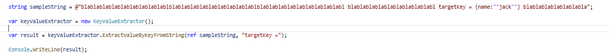
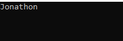

# StringFighter
Simple but functional string functions that I think might be useful.

## StringExtractors

This field contains functions for extracting desired values ​​in a string.
 
:rabbit2: **KeyValueExtracor**

KeyValueExtractor finds and extracts the value of a given keyword in a string.

It can extract values ​​from string, object, array, numeric (int, decimal etc).
      
*Usage*    

*Result*

:rabbit2: **ChangingValueExtractor**

ChangingValueExtractor extracts the changed value within a string template.

*Usage*

*Result*

:rabbit2: **ChangingValuesExtractor**

"ChangingValue(S)Extractor" does almost the same as "ChangingValueExtractor"
the difference is that it extracts more than one variable value.

*Usage*

*Result*

